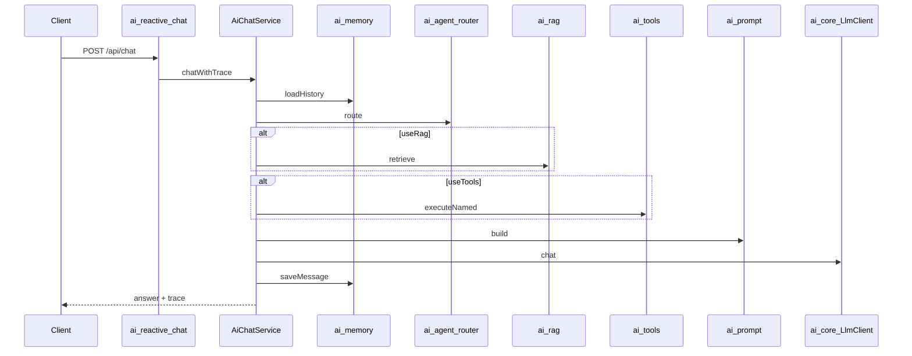

# 第 1 篇：ai-customer-service 系统架构与设计理念

> ai-customer-service 不是 LangChain4j 全家桶 Demo，而是 **「LC4J 作 Model Layer + Spring 自研编排」** 的可运行骨架。系列目标：说清用了什么、为什么没用其余能力、以及何时/如何演进。

**下一篇**：[第 2 篇：LangChain4j 能力全景 × 项目使用矩阵](./02-langchain4j-capability-matrix.md)

---

## 写在前面

如果你是一名 **Java / Spring Boot 后端**，已经听说过 LangChain4j，但看到的多是 `AiServices.builder()` 一行 Agent 的教程，可能会疑惑：真实项目里 Memory、RAG、Tools 到底该谁管？

本系列基于仓库 **[ai-customer-service](https://github.com)**（示例工程）展开。本篇不讲 LangChain4j API 细节，只回答三件事：

1. 这个项目解决什么问题？
2. 一次用户消息在系统里怎么流转？
3. LangChain4j 在其中占多大比重？

读完后你应能本地跑通聊天接口，并在前端看到 **Agent / RAG / Tool / Prompt** 调试面板——这是本仓库与「curl 调一次 OpenAI」的本质区别。

---

## 你将学到什么

- ai-customer-service 的定位与 14 个 Maven 模块职责
- **编排层** `AiChatService` 为什么是「大脑」
- SPI 解耦：换 Redis 记忆、换向量库为何不必改管道
- 双应用（8080 管理 + 8081 聊天）的拆分理由
- LangChain4j **仅用 ChatModel + EmbeddingModel** 的预告
- 动手启动服务、调用 `/api/chat`、阅读 trace JSON

---

## 环境准备

| 依赖 | 版本要求 |
|------|----------|
| JDK | 17+ |
| Maven | 3.8+ |
| Node.js（可选，前端） | 18+ |
| API Key | **不需要**（默认 LangChain4j demo endpoint） |

克隆仓库后进入后端根目录：

```bash
cd ai-customer-service
```

开发环境建议在 [ai-reactive-chat/src/main/resources/application.yml](../../ai-reactive-chat/src/main/resources/application.yml) 保持：

```yaml
aics:
  observability:
    expose-prompt-trace: true   # 开发：返回完整 prompt / RAG / Agent 决策
```

---

## 1. 项目定位与价值

### 1.1 这个项目是做什么的？

**ai-customer-service** 是一个可运行的 **AI 客服 / 对话式智能服务** 示例：用户发消息，系统经编排后调用大模型并返回答案，并可按需接入知识检索（RAG）、工具调用与会话记忆。

它解决的核心问题不是「如何调一次 OpenAI API」，而是：

> 把「对话 + 检索 + 工具 + 记忆 + 提示词 + 模型调用」拆成清晰边界，便于本地演示、替换实现与逐步演进到生产形态。

### 1.2 一句话本质

引用 [SYSTEM_ARCHITECTURE.md](../SYSTEM_ARCHITECTURE.md)：

> **以编排层为中心、SPI 可插拔的 LangChain4j 风格 AI 客服后端骨架。**

「LangChain4j 风格」指能力分层与管道式编排思想，**不是**把所有逻辑交给 LangChain4j 的 `AiServices`。

### 1.3 配套前端：可观测，而非 curl Demo

仓库 **[ai-customer-front](../../../ai-customer-front/)**（React + Vite）对接 8081/8080，提供：

- 聊天主界面
- **Agent 决策面板**：Router 是否启用 RAG/Tools、工具名、理由
- **RAG 上下文面板**：检索片段
- **Tool 结果面板**：工具 JSON 输出
- **Prompt 面板**：发给模型的完整 prompt


> **截图说明**：在 `ai-customer-front` 执行 `npm run dev`，打开 Chat 页，输入「我的订单123为什么还没有发货？」。


> **截图说明**：发送消息后，在助手回复下方展开「Agent 编排调试」区域，四个子面板均应有内容（需 `expose-prompt-trace: true`）。

---

## 2. 技术框架

### 2.1 运行时与构建

| 项目 | 说明 |
|------|------|
| Java | 17 |
| 构建 | Apache Maven 多模块 |
| 框架 | Spring Boot 3.3.x |
| 韧性 | Resilience4j（熔断 / 重试 / 限流） |
| LLM | LangChain4j 1.13.0（仅 `ai-core`、`ai-rag`） |

### 2.2 双应用分离

| 应用 | 模块 | 端口 | 职责 |
|------|------|------|------|
| 聊天服务 | `ai-reactive-chat` | **8081** | WebFlux，`POST /api/chat`、`/api/chat/stream` |
| 管理端 | `ai-admin-webmvc` | **8080** | MVC，Prompt / RAG 入库 / Eval |

**为何拆两个进程？**

- 聊天：高并发 IO、SSE → WebFlux + Netty
- 管理：CRUD、阻塞 IO → MVC 更简单
- 生产：可独立扩缩容


> **截图说明**：两个终端分别 `spring-boot:run`，浏览器访问 `http://localhost:8080/actuator/health` 与确认 8081 聊天可用。

### 2.3 模块一览

| 模块 | 职责 |
|------|------|
| `ai-parent` | BOM |
| `ai-common` | **SPI**（`LlmClient`、`ChatMemory` 等） |
| `ai-model` | DTO |
| `ai-core` | LangChain4j ChatModel + `LlmClient` |
| `ai-prompt` | `PromptComposer` |
| `ai-rag` | 嵌入 + 自研 VectorStore |
| `ai-memory` | 会话记忆 |
| `ai-tools` | 工具执行 |
| `ai-agent-router` | Agent 路由 |
| `ai-eval` | 能力档位评测 |
| `ai-service` | **编排** `AiChatService` |
| `ai-reactive-chat` | 可执行：聊天 |
| `ai-admin-webmvc` | 可执行：管理 |


> **截图说明**：IDE 中展开 `ai-customer-service` 聚合工程，或执行 `find . -name pom.xml | head -20`。

---

## 3. 整体架构

### 3.1 分层架构图

```
┌─────────────────────────────────────────────────────────────┐
│  Controller（可执行应用层）                                    │
│  • ai-reactive-chat：聊天 API（WebFlux，8081）                 │
│  • ai-admin-webmvc：管理 / RAG / Prompt（MVC，8080）          │
└──────────────────────────┬──────────────────────────────────┘
                           ↓
┌─────────────────────────────────────────────────────────────┐
│  AI Service（编排层 —— “大脑”）                              │
│  ai-service → AiChatService                                  │
└──────────────────────────┬──────────────────────────────────┘
                           ↓
        ┌──────────────────┼──────────────────┐
        ↓                  ↓                  ↓
   ai-core            ai-prompt            ai-rag
   ai-memory          ai-tools             ai-eval
```

### 3.2 核心调用时序



### 3.3 编排中枢：AiChatService

管道顺序**只在此处定义**（[`AiChatService.java`](../../ai-service/src/main/java/com/aics/service/chat/AiChatService.java)）：

```java
String history = memory.loadHistory(sessionId);
AgentDecision decision = agentRouter.route(message, history);

boolean useRag = orchestrationProperties.isRagEnabled() && decision.useRag();
List<String> context = useRag ? rag.retrieve(message) : Collections.emptyList();

boolean useTools = orchestrationProperties.isToolsEnabled() && decision.useTools();
String toolResult = useTools ? tools.executeNamed(decision.toolName(), message) : "";

String prompt = promptComposer.build(history, context, toolResult, message);
String answer = llm.chat(prompt);
memory.saveMessage(sessionId, message, answer);
```

LangChain4j 出现在 **`llm.chat(prompt)`** 以及 RAG 模块的 embed 步骤；其余均为 Spring 自研。

---

## 4. 设计理念

### 4.1 编排层思想

「先记忆 → 路由 → RAG → Tools → Prompt → LLM → 写记忆」**只在一处定义**。改流程只改 `AiChatService`，测试可手动构造实例（见 `AiServiceEvolutionTest`）。

### 4.2 SPI 解耦

| SPI | 实现模块 |
|-----|----------|
| `LlmClient` | ai-core |
| `ChatMemory` | ai-memory |
| `KnowledgeRetriever` | ai-rag |
| `ToolExecutor` | ai-tools |
| `PromptComposer` | ai-prompt |

换 Redis 记忆 = 换 `MemoryStore` Bean，**不改** `AiChatService`。

### 4.3 AI 系统 ≠ CRUD

按 **能力边界** 拆模块（model / memory / rag / tools / prompt / router / service），而非按数据库表拆 Service。

### 4.4 可观测与功能开关

- `chatWithTrace()` → [`ChatTraceResponse`](../../ai-reactive-chat/src/main/java/com/aics/reactivechat/dto/ChatTraceResponse.java)
- `aics.observability.expose-prompt-trace`：开发 true，生产 false
- `aics.orchestration.rag-enabled` / `tools-enabled` / `agent-router-llm-enabled`

---

## 5. LangChain4j 使用程度（预告）

| 状态 | 能力 |
|------|------|
| **已用** | `OpenAiChatModel`、`EmbeddingModel` |
| **未用** | AiServices、ChatMemory、@Tool、EmbeddingStore、StreamingChatModel |

> LangChain4j 覆盖 **模型 I/O 层**；编排 / 存储 / 工具执行由业务层负责。详见 [第 2 篇](./02-langchain4j-capability-matrix.md)。

---

## 6. 能力演进演示

[`AiServiceEvolutionTest`](../../ai-service/src/test/java/com/aics/service/evolution/AiServiceEvolutionTest.java) 用固定问题分阶段对比 prompt：

| 阶段 | prompt 新增 |
|------|-------------|
| BASE | 仅用户原句 |
| PROMPT | 客服角色 + `### 用户问题` |
| RAG | `### 参考知识` |
| FULL | + `### 历史对话` + `### 工具结果` |

[`CapabilityChatFactory`](../../ai-eval/src/main/java/com/aics/eval/support/CapabilityChatFactory.java) 支持无 Spring 复现。

---

## 动手验证

### 步骤 1：编译

```bash
cd ai-customer-service
mvn clean compile -q
```

```text
# 预期：BUILD SUCCESS（父 pom 默认 skipTests，compile 应通过）
```

### 步骤 2：启动聊天服务（8081）

```bash
mvn -pl ai-reactive-chat spring-boot:run
```

```text
# 预期输出片段
  .   ____          _            __ _ _
 /\\ / ___'_ __ _ _(_)_ __  __ _ \ \ \ \
 ...
 Netty started on port 8081 (http)
 Started ReactiveChatApplication in X.XXX seconds
```

### 步骤 3：调用聊天接口（含 trace）

另开终端：

```bash
curl -s -X POST http://localhost:8081/api/chat \
  -H "Content-Type: application/json" \
  -d '{"sessionId":"blog-demo-1","message":"我的订单123为什么还没有发货？"}' | jq .
```

```text
# 预期 JSON 结构（expose-prompt-trace=true 时字段有值；answer 为模型真实回复，以下为结构示例）
{
  "answer": "（模型生成的中文答复……）",
  "agentDecision": {
    "useRag": true,
    "useTools": true,
    "toolName": "order_query",
    "reason": "用户询问订单发货状态，需要查订单并检索发货政策"
  },
  "ragContext": [
    "订单支付成功后，仓库通常在1-3个工作日内发货；大促期间可能延长。"
  ],
  "toolResult": "{\"orderId\":\"123\",\"status\":\"拣货中\",...}",
  "prompt": "你是专业 AI 客服助手...\n\n### 参考知识\n[1] ...\n\n### 工具结果\n...\n\n### 用户问题\n我的订单123..."
}
```

当 `expose-prompt-trace: false` 时，[`ChatTraceResponse.answerOnly`](../../ai-reactive-chat/src/main/java/com/aics/reactivechat/dto/ChatTraceResponse.java) 仅 `answer` 有值，其余为空占位。

### 步骤 4：演进测试（无需启动服务）

```bash
mvn -pl ai-service test -Dtest=AiServiceEvolutionTest -DskipTests=false -Dmaven.test.skip=false
```

```text
# 预期控制台片段（RecordingLlmClient 模拟答复）
============ BASE ============
【模拟答复-纯模型】仓库可能比较忙吧，一般等等就会发……

============ PROMPT ============
【模拟答复-Prompt版】已按客服角色与段落结构组织问题……

============ RAG ============
【模拟答复-RAG】依据参考知识：未发货常见于大促排期……

============ FULL ============
【模拟答复-全能力】结合历史、知识库与订单工具：订单123当前「拣货中」……

Tests run: 4, Failures: 0
```

### 步骤 5（可选）：启动管理端 + 前端

```bash
# 终端 A
mvn -pl ai-admin-webmvc spring-boot:run

# 终端 B（仓库根目录 ai-customer-front）
npm install && npm run dev
```

---

## 常见问题 FAQ

**Q：`8081` 启动失败，端口占用？**  
A：修改 `ai-reactive-chat/src/main/resources/application.yml` 中 `server.port`，或释放占用进程。

**Q：curl 返回的 `prompt` 为空？**  
A：检查 `aics.observability.expose-prompt-trace` 是否为 `true`（聊天服务 yml）。

**Q：是否需要 OpenAI API Key？**  
A：默认 [`LlmConfig`](../../ai-core/src/main/java/com/aics/core/config/LlmConfig.java) 使用 LangChain4j demo endpoint，Key 填 `demo` 即可本地体验。

**Q：和 LangChain4j 官方 AiServices 示例有何不同？**  
A：本仓库强调 **可观测编排管道**；LangChain4j 仅作 Model Layer。见系列第 2、7 篇。

---

## 本篇小结

| 要点 | 内容 |
|------|------|
| 项目本质 | 可运行、可观测、可替换的 AI 客服后端骨架 |
| 架构核心 | `AiChatService` + SPI |
| LangChain4j | 仅 ChatModel + EmbeddingModel |
| 验证方式 | 8081 `/api/chat` + 前端四面板 + 演进测试 |

---

## 系列导航

| 篇目 | 链接 |
|------|------|
| 下一篇 | [第 2 篇：LangChain4j 能力全景 × 项目使用矩阵](./02-langchain4j-capability-matrix.md) |
| 系列索引 | [README](./README.md) |
| 发布规范 | [PUBLISHING.md](./PUBLISHING.md) |
