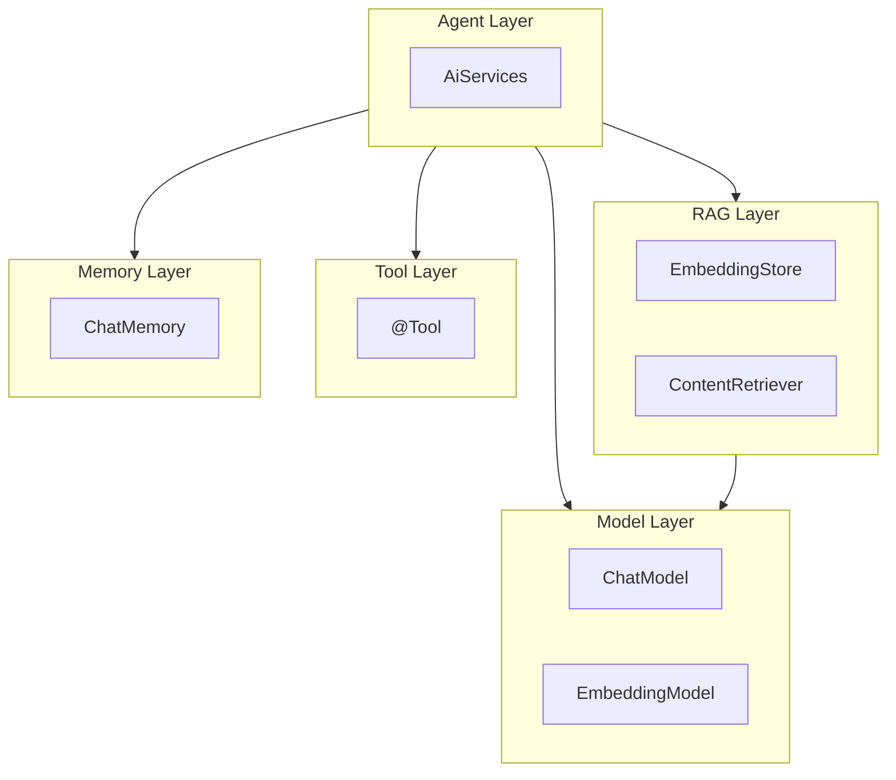

# 第 2 篇：LangChain4j 能力全景 × 项目使用矩阵

> ai-customer-service 不是 LangChain4j 全家桶 Demo，而是 **「LC4J 作 Model Layer + Spring 自研编排」** 的可运行骨架。

**上一篇**：[第 1 篇：系统架构与设计理念](./01-system-architecture.md)  
**下一篇**：[第 3 篇：ChatModel — 已用能力与改进空间](./03-chatmodel.md)

---

## 写在前面

读完第 1 篇，你已经知道项目有一个显式的 `AiChatService` 管道。本篇回答：**LangChain4j 到底提供了哪些能力？本项目用了其中多少？没用的话用什么替代、优缺点是什么？**

读表时请带着一个实际问题：**「如果我要加 Redis 记忆 / Milvus 向量库 / Function Calling，该用 LC4J 还是自己写？」**——第 3–8 篇会逐项深读，本篇先给全景地图。

---

## 你将学到什么

- LangChain4j 六层能力模型（Model / Memory / Tool / RAG / Agent / 辅助）
- 与 Spring AI、裸 HTTP 的一句话定位对比
- **项目使用矩阵**（系列核心表格）
- 四维选型法：开发效率、可控性、可观测性、生产适配
- `mvn dependency:tree` 验证 LC4J 仅存在于 ai-core / ai-rag
- BASE vs FULL 的 prompt 结构 diff

---

## 环境准备

```bash
cd ai-customer-service
# 可选：确认 LangChain4j 依赖范围
mvn dependency:tree -pl ai-core,ai-rag 2>/dev/null | grep langchain4j
```

---

## 1. LangChain4j 在 Java 生态中的位置

| 方案 | 定位 |
|------|------|
| **裸 HTTP**（OkHttp + JSON） | 最灵活，一切自己拼；多模型兼容成本高 |
| **LangChain4j** | Java 原生 LLM 框架，Model / Agent / RAG 分层 API |
| **Spring AI** | Spring 官方 AI 抽象，与 Boot 集成深 |
| **本项目** | LangChain4j **仅 Model Layer** + Spring 自研编排 |

三者不是互斥：许多团队用 LangChain4j 的 `OpenAiChatModel`，编排仍自己写——这正是本仓库示范的路径。

---

## 2. LangChain4j 能力分层




> **截图说明**：将上文 mermaid 导出为 PNG，或使用 draw.io 重绘六层结构。

| 层级 | 典型 API | 职责 |
|------|----------|------|
| Model Layer | `ChatModel`, `StreamingChatModel`, `EmbeddingModel` | 模型 I/O |
| Memory Layer | `ChatMemory`, `MessageWindowChatMemory` | 多轮上下文 |
| Tool Layer | `@Tool`, `ToolSpecification` | Function calling |
| RAG Layer | `EmbeddingStore`, `ContentRetriever`, `RetrievalAugmentor` | 检索增强 |
| Agent Layer | `AiServices`, `@MemoryId` | 声明式 Agent |
| 辅助 | `Document`, `EmbeddingStoreIngestor` | 文档入库 |

---

## 3. 项目使用矩阵（核心）

| LC4J 能力 | 项目状态 | 替代实现 | 关键文件 |
|-----------|----------|----------|----------|
| `OpenAiChatModel` | **已用** | `OpenAiLlmClient` → `LlmClient` | `ai-core/.../LlmConfig.java` |
| `EmbeddingModel` | **已用** | `LangChain4jEmbeddingService` | `ai-rag/.../LangChain4jEmbeddingService.java` |
| `ChatMemory` | 未用 | `DefaultChatMemory` | `ai-memory/.../DefaultChatMemory.java` |
| `@Tool` | 未用 | `Tool` SPI + Router | `ai-tools/.../Tool.java` |
| `EmbeddingStore` | 未用 | `VectorStore` | `ai-rag/.../vectorstore/` |
| `ContentRetriever` | 未用 | `DefaultPromptComposer` | `ai-prompt/.../DefaultPromptComposer.java` |
| `AiServices` | 未用 | `AiChatService` | `ai-service/.../AiChatService.java` |
| `StreamingChatModel` | 未用 | 字符模拟 SSE | `ChatReactiveController` |

### 3.1 Maven 依赖验证


> **截图说明**：打开 `ai-core/pom.xml` 与 `ai-rag/pom.xml` 中的 langchain4j 依赖段。

```bash
mvn dependency:tree -pl ai-core -Dincludes=dev.langchain4j 2>/dev/null
```

```text
# 预期输出片段
[INFO] com.aics:ai-core:jar:1.0.0-SNAPSHOT
[INFO] +- dev.langchain4j:langchain4j:jar:1.13.0:compile
[INFO] \- dev.langchain4j:langchain4j-open-ai:jar:1.13.0:compile
```

```bash
mvn dependency:tree -pl ai-rag -Dincludes=dev.langchain4j 2>/dev/null
```

```text
[INFO] +- dev.langchain4j:langchain4j:jar:1.13.0:compile
[INFO] \- dev.langchain4j:langchain4j-embeddings-all-minilm-l6-v2:jar:1.13.0-beta23:compile
```

**结论**：`ai-memory`、`ai-tools`、`ai-service` 等模块 **pom 中无 langchain4j**，通过 SPI 间接使用模型能力。

---

## 4. 读表指南：四维选型

对每一项能力，从四个维度判断「用 LC4J 还是自研」：

| 维度 | 问什么 |
|------|--------|
| **开发效率** | 能否少写代码快速跑通？ |
| **可控性** | 流程、开关、安全边界是否可精确控制？ |
| **可观测性** | 能否 trace 每一步（Router/RAG/Tool/Prompt）？ |
| **生产适配** | 持久化、扩容、换供应商是否成熟？ |

### 4.1 已用能力小结

**ChatModel + EmbeddingModel**

- LC4J 胜：OpenAI 兼容 builder、本地 ONNX 嵌入
- 项目加成：`ResilientLlmClient` 与 LC4J timeout 职责分离

### 4.2 未用能力共性原因

1. **trace** — `chatWithTrace` + 前端四面板
2. **开关** — [`OrchestrationProperties`](../../ai-service/src/main/java/com/aics/service/config/OrchestrationProperties.java)
3. **SPI 可替换** — Redis Memory、PG VectorStore
4. **演进测试** — 断言 `### 参考知识` 等固定结构

---

## 5. 「用 vs 不用」总表

| LC4J 能力 | 效率 | 可控 | 观测 | 生产 | 项目选择 |
|-----------|:----:|:----:|:----:|:----:|----------|
| ChatModel | LC4J | 平 | 项目 | 平 | **用** |
| EmbeddingModel | LC4J | 平 | 项目 | 平 | **用** |
| ChatMemory | LC4J | 项目 | 项目 | 项目 | **自研** |
| @Tool | LC4J | 项目 | 项目 | LC4J | **自研→演进** |
| EmbeddingStore | LC4J | 项目 | 项目 | LC4J | **自研→中期引入** |
| AiServices | LC4J | 项目 | 项目 | 项目 | **自研** |
| Streaming | LC4J | 平 | 项目 | LC4J | **待演进** |

---

## 6. 对照实验：BASE vs FULL prompt

[`DefaultPromptComposer`](../../ai-prompt/src/main/java/com/aics/prompt/composer/DefaultPromptComposer.java) 结构：

```text
你是专业 AI 客服助手……

### 历史对话          ← FULL / MEMORY 档位
用户: …
AI: …

### 参考知识          ← RAG 档位
[1] 订单支付成功后……

### 工具结果          ← FULL 档位
{"orderId":"123",...}

### 用户问题
我的订单123为什么还没有发货？
```

运行演进测试对比 ORDER 1 vs ORDER 4：

```bash
mvn -pl ai-service test -Dtest=AiServiceEvolutionTest#testBaseLLM+testFullAiService -DskipTests=false -Dmaven.test.skip=false
```

```text
# ORDER 1 BASE — lastPrompt 不含「参考知识」
# ORDER 4 FULL — lastPrompt 同时含：
#   ### 历史对话
#   ### 参考知识
#   ### 工具结果
#   ### 用户问题
```


> **截图说明**：分别用 CapabilityChatFactory 五档或实际聊天对比 prompt 段落差异。

---

## 动手验证

### 验证 1：确认 SPI 模块不依赖 LC4J

```bash
mvn dependency:tree -pl ai-memory,ai-tools,ai-service -Dincludes=dev.langchain4j 2>/dev/null | grep -c langchain4j || echo "0 matches"
```

```text
# 预期：0 matches（无 langchain4j 依赖）
0 matches
```

### 验证 2：expose-prompt-trace 两种响应

**true**（8081 默认开发配置）— 见第 1 篇 curl 完整 JSON。

**false** — 临时修改 yml 后：

```json
{
  "answer": "（仅有答复）",
  "agentDecision": { "useRag": false, "useTools": false, "toolName": "", "reason": "" },
  "ragContext": [],
  "toolResult": "",
  "prompt": ""
}
```

---

## 常见问题 FAQ

**Q：为什么不用 Spring AI？**  
A：本系列聚焦 LangChain4j；架构思想相同——Model 层可替换，编排可自研。

**Q：是不是「用得越少越好」？**  
A：不是。该用 Model Layer；高层 API 在 POC 场景很合适，客服生产更重 trace 与开关。

**Q：Part 3 从哪里开始读？**  
A：已用能力从 [第 3 篇 ChatModel](./03-chatmodel.md)；未用从 [第 5 篇 Memory](./05-chat-memory.md) 或 [第 6 篇 Tools](./06-tools.md)。

---

## 本篇小结

> **LangChain4j = Java 侧 Model SDK；Memory / Tools / RAG Store / 编排 = 业务层责任。**

| 已用 | 未用（主因） |
|------|--------------|
| ChatModel、EmbeddingModel | trace、开关、SPI、演进测试 |

---

## 系列导航

| 篇目 | 链接 |
|------|------|
| 上一篇 | [第 1 篇](./01-system-architecture.md) |
| 下一篇 | [第 3 篇：ChatModel](./03-chatmodel.md) |
| 索引 | [README](./README.md) |
