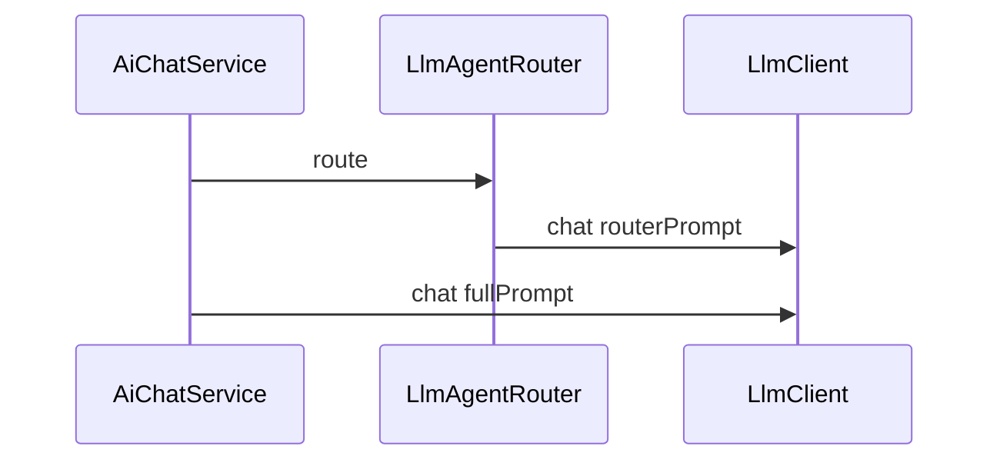

# 第 3 篇：ChatModel — 已用能力与改进空间

> ai-customer-service 不是 LangChain4j 全家桶 Demo，而是 **「LC4J 作 Model Layer + Spring 自研编排」** 的可运行骨架。

**上一篇**：[第 2 篇](./02-langchain4j-capability-matrix.md) | **下一篇**：[第 4 篇：RAG](./04-embedding-rag.md)

---

## 写在前面

LangChain4j 入门往往从 `OpenAiChatModel.builder()` 开始。本项目在 **ai-core** 中同样使用 `OpenAiChatModel`，但外面包了 **SPI + Resilience4j + 双场景复用（路由 + 主对话）**。本篇带你逐层读代码，并指出生产上应如何改进。

---

## 你将学到什么

- `ChatModel` / `ChatRequest` 典型用法
- 代码路径：`LlmConfig` → `OpenAiLlmClient` → `ResilientLlmClient` → `LlmAgentRouter`
- LangChain4j demo endpoint 零 Key 体验
- 硬编码、双 Client 共用、无 token 计量等缺口
- 推荐演进：`LlmProperties`、router/chat Client 分离

---

## 1. LangChain4j ChatModel 介绍

```java
OpenAiChatModel model = OpenAiChatModel.builder()
    .apiKey(System.getenv("OPENAI_API_KEY"))
    .modelName("gpt-4o-mini")
    .temperature(0.3)
    .timeout(Duration.ofSeconds(60))
    .logRequests(true)
    .logResponses(true)
    .build();

String answer = model.chat("你好");

ChatRequest request = ChatRequest.builder()
    .messages(
        SystemMessage.from("你是专业 AI 客服助手。"),
        UserMessage.from("我的订单123为什么还没发货？")
    )
    .build();
ChatResponse response = model.chat(request);
// TokenUsage usage = response.tokenUsage();
```

---

## 2. 项目代码走读

### 2.1 LlmConfig — LangChain4j Bean

[`LlmConfig.java`](../../ai-core/src/main/java/com/aics/core/config/LlmConfig.java)：

```java
return OpenAiChatModel.builder()
    .apiKey("demo")
    .baseUrl("http://langchain4j.dev/demo/openai/v1")
    .modelName("gpt-4o-mini")
    .temperature(0.3)
    .timeout(Duration.ofSeconds(60))
    .logRequests(true)
    .logResponses(true)
    .build();
```

### 2.2 OpenAiLlmClient — SPI 适配

[`OpenAiLlmClient.java`](../../ai-core/src/main/java/com/aics/core/llm/OpenAiLlmClient.java)：`model.chat(prompt)`，编排层只见 `LlmClient`。

### 2.3 ResilientLlmClient — Spring 侧韧性

[`LlmOutboundResilienceConfiguration.java`](../../ai-service/src/main/java/com/aics/service/resilience/LlmOutboundResilienceConfiguration.java) 注册 `@Primary LlmClient`，实例名 `llm`（见 [application.yml](../../ai-reactive-chat/src/main/resources/application.yml)）。

### 2.4 双 LLM 调用

[`LlmAgentRouter`](../../ai-agent-router/src/main/java/com/aics/agentrouter/LlmAgentRouter.java) 与主对话 **共用** 同一 `LlmClient`：




> **截图说明**：`logRequests(true)` 时控制台打印发往 demo endpoint 的请求体。


---

## 3. 不当之处

| 问题 | 影响 | 更好做法 |
|------|------|----------|
| 配置硬编码 | 无法按环境切换 | `@ConfigurationProperties` |
| 单轮 String chat | 无 system/user、无 tool_calls | 扩展 `ChatRequest` |
| 路由/主对话共用 Client | 路由失败或触发熔断影响主链路 | 分离 `llm-router` / `llm` 实例 |
| 无 token 计量 | 成本不可见 | `tokenUsage()` → Micrometer |

---

## 4. 推荐演进（仓库尚未实现，可照搬）

### 4.1 LlmProperties

```java
@ConfigurationProperties(prefix = "aics.llm")
public record LlmProperties(
    String apiKey, String baseUrl, String modelName,
    double temperature, Duration timeout) {}
```

```yaml
aics:
  llm:
    api-key: ${OPENAI_API_KEY:demo}
    base-url: ${OPENAI_BASE_URL:http://langchain4j.dev/demo/openai/v1}
    model-name: gpt-4o-mini
```

### 4.2 分离 router / chat Client

```java
@Bean(name = "routerLlmClient")
public LlmClient routerLlmClient(...) {
    return new ResilientLlmClient(delegate,
        cb.circuitBreaker("llm-router"), retry.retry("llm-router"));
}
```

---

## 动手验证

### 零 Key 聊天

```bash
mvn -pl ai-reactive-chat spring-boot:run
curl -s -X POST http://localhost:8081/api/chat \
  -H "Content-Type: application/json" \
  -d '{"sessionId":"p3-demo","message":"你好，请用一句话介绍你自己"}' | jq .answer
```

```text
# 预期：非空中文答复字符串（来自 demo 模型）
"您好！我是……"
```

### logRequests 日志片段

```text
# 预期控制台（结构示意）
HTTP request:
- method: POST
- url: http://langchain4j.dev/demo/openai/v1/chat/completions
- body: {"model":"gpt-4o-mini","messages":[{"role":"user","content":"..."}],...}
```

### Router JSON 决策（trace 内）

```json
"agentDecision": {
  "useRag": false,
  "useTools": false,
  "toolName": "",
  "reason": "纯寒暄，无需检索或工具"
}
```

---

## FAQ

**Q：该不该换 AiServices？**  
A：仅为 Chat 不必；见 [第 7 篇](./07-aiservices.md)。

**Q：demo endpoint 不稳定？**  
A：配置 `aics.llm.base-url` 指向自有 OpenAI 兼容网关。

---

## 本篇小结

> **继续用 LC4J ChatModel；优先改配置外化与 Client 分离，而非引入 AiServices。**

---

## 系列导航

[第 2 篇](./02-langchain4j-capability-matrix.md) | [第 4 篇](./04-embedding-rag.md) | [README](./README.md)
