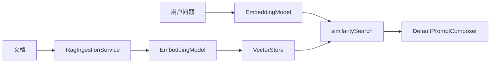

# 第 4 篇：EmbeddingModel + RAG — 半用半自建

> ai-customer-service 不是 LangChain4j 全家桶 Demo，而是 **「LC4J 作 Model Layer + Spring 自研编排」** 的可运行骨架。

**上一篇**：[第 3 篇](./03-chatmodel.md) | **下一篇**：[第 5 篇：Memory](./05-chat-memory.md)

---

## 写在前面

RAG 是客服场景标配。本项目的特点是：**嵌入用 LangChain4j，存检索自己写，Prompt 手动拼 `### 参考知识`**。本篇带你在 8080 入库、8081 聊天验证全链路。

---

## 你将学到什么

- LC4J `EmbeddingModel` + `AllMiniLmL6V2EmbeddingModel`
- 入库 → 切分 → embed → VectorStore → retrieve → Prompt
- 管理端 `POST /api/rag/add` 实操
- `aics.rag.vector-store` 切换 in-memory / h2 / postgres
- 何时引入 LC4J `EmbeddingStore`

---

## 1. LangChain4j RAG API 简介

```java
EmbeddingModel model = new AllMiniLmL6V2EmbeddingModel();
float[] vector = model.embed("发货时效").content().vector();

EmbeddingStoreIngestor.builder()
    .embeddingModel(model).embeddingStore(store).build().ingest(document);

ContentRetriever retriever = EmbeddingStoreContentRetriever.builder()
    .embeddingStore(store).embeddingModel(model).maxResults(3).build();
```

---

## 2. 项目实现

### 2.1 嵌入层（LC4J）

[`AiRagAutoConfiguration.java`](../../ai-rag/src/main/java/com/aics/rag/autoconfigure/AiRagAutoConfiguration.java)：

```java
return new AllMiniLmL6V2EmbeddingModel();
```

[`LangChain4jEmbeddingService`](../../ai-rag/src/main/java/com/aics/rag/embedding/LangChain4jEmbeddingService.java) 封装为 `float[]`。

### 2.2 检索层（自研）

[`DefaultKnowledgeRetriever`](../../ai-rag/src/main/java/com/aics/rag/retriever/DefaultKnowledgeRetriever.java)：

```java
float[] q = embeddingService.embed(question);
List<ScoredMatch> hits = vectorStore.similaritySearch(q, topK, minScore);
```

### 2.3 Prompt 注入（非 RetrievalAugmentor）

[`DefaultPromptComposer`](../../ai-prompt/src/main/java/com/aics/prompt/composer/DefaultPromptComposer.java) → `### 参考知识`。

### 2.4 Router 门控

仅当 `decision.useRag() && ragEnabled` 才检索。




---

## 3. 是否应该用 EmbeddingStore？

| 场景 | 建议 |
|------|------|
| 教学 / 演示 | 当前 InMemory/H2 足够 |
| Milvus / pgvector 生产 | **中期引入** LC4J EmbeddingStore |
| Router 门控 + trace | **保留** 自研检索结果进 trace |

### 混合迁移（伪代码）

```java
ContentRetriever retriever = EmbeddingStoreContentRetriever.builder()
    .embeddingStore(pgStore).embeddingModel(embeddingModel).maxResults(topK).build();
List<String> context = retriever.retrieve(Query.from(question))
    .stream().map(c -> c.textSegment().text()).toList();
// 仍交给 DefaultPromptComposer，不用 RetrievalAugmentor
```

---

## 4. vector-store 配置

[`RagProperties`](../../ai-rag/src/main/java/com/aics/rag/config/RagProperties.java)：

```yaml
aics:
  rag:
    enabled: true
    vector-store: in-memory   # in-memory | h2 | postgres | milvus
    chunk-size: 512
    retrieval-top-k: 5
    min-score: 0.0
```

---

## 动手验证

### 步骤 1：启动管理端（8080）

```bash
mvn -pl ai-admin-webmvc spring-boot:run
```

### 步骤 2：入库知识

```bash
curl -s -X POST http://localhost:8080/api/rag/add \
  -H "Content-Type: application/json" \
  -d '{
    "title": "发货时效说明",
    "content": "订单支付成功后，仓库通常在1-3个工作日内发货；大促期间可能延长。订单进入拣货中表示已排产。"
  }' | jq .
```

```text
{
  "id": "（UUID 或自增 ID）",
  "title": "发货时效说明",
  "content": "订单支付成功后……",
  "chunkCount": 1
}
```

### 步骤 3：启动聊天服务并提问

```bash
# 另开终端
mvn -pl ai-reactive-chat spring-boot:run

curl -s -X POST http://localhost:8081/api/chat \
  -H "Content-Type: application/json" \
  -d '{"sessionId":"rag-demo","message":"付款后多久发货？"}' | jq '.ragContext, .agentDecision.useRag'
```

```text
[
  "订单支付成功后，仓库通常在1-3个工作日内发货……"
]
true
```

---

## FAQ

**Q：Milvus adapter 报错？**  
A：[`MilvusVectorStoreAdapter`](../../ai-rag/src/main/java/com/aics/rag/vectorstore/MilvusVectorStoreAdapter.java) 为占位，生产需接官方 SDK 或 LC4J Milvus 集成。

**Q：admin 与 chat 是否共享向量库？**  
A：同进程内默认 InMemory 在 **各自 JVM** 不共享；生产应对两应用配置同一 postgres 向量库或通过 admin 入库后 chat 连同一 DB。

---

## 本篇小结

> **嵌入用 LC4J，存储检索看场景；保留 Router 门控与 Prompt 显式注入。**

---

## 系列导航

[第 3 篇](./03-chatmodel.md) | [第 5 篇](./05-chat-memory.md) | [README](./README.md)
