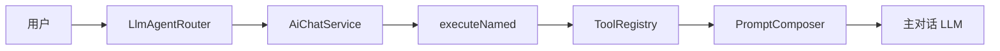

# 第 6 篇：Tools — Router 分离与 @Tool 分阶段演进

> ai-customer-service 不是 LangChain4j 全家桶 Demo，而是 **「LC4J 作 Model Layer + Spring 自研编排」** 的可运行骨架。

**上一篇**：[第 5 篇](./05-chat-memory.md) | **下一篇**：[第 7 篇：AiServices](./07-aiservices.md)

---

## 写在前面

LangChain4j `@Tool` + AiServices 可让模型 **自动** 决定调工具。本项目选择 **Router 决策 → Java 执行 → Prompt 注入 → 主 LLM 总结**，换取 **可审计 trace 与固定 2 次 LLM 调用**。本篇演示三个内置工具，并给出向 LC4J function calling 演进的路线。

---

## 你将学到什么

- LC4J `@Tool` 与 tool loop
- 项目路径：Router → `executeNamed` → `ToolRegistry`
- echo / order_query / weather_query 实操
- `FallbackAgentRouter` 规则回退
- 分阶段引入 `@Tool` + ToolSpecification

---

## 1. LangChain4j Tools

```java
public class OrderTools {
    @Tool("查询订单状态")
    String orderQuery(@P("订单号") String orderId) { return "..."; }
}

AiServices.builder(Agent.class)
    .chatModel(model).tools(new OrderTools()).build();
// 内部：model → tool_calls → execute → model → …
```

---

## 2. 项目设计：决策与执行分离



### 2.1 Router JSON

[`AgentRouterPrompts`](../../ai-agent-router/src/main/java/com/aics/agentrouter/prompt/AgentRouterPrompts.java) 强制输出：

```json
{"useRag":true,"useTools":true,"toolName":"order_query","reason":"…"}
```

[`LlmAgentRouter.sanitize`](../../ai-agent-router/src/main/java/com/aics/agentrouter/LlmAgentRouter.java) 白名单：`echo`, `order_query`, `weather_query`。

### 2.2 Tool SPI

[`OrderQueryTool`](../../ai-tools/src/main/java/com/aics/tools/builtin/OrderQueryTool.java) 含 `inputSchemaJson()`，预留 MCP。

### 2.3 Fallback

[`FallbackAgentRouter`](../../ai-service/src/main/java/com/aics/service/orchestration/router/FallbackAgentRouter.java)：JSON 解析失败 → [`RuleBasedAgentRouter`](../../ai-service/src/main/java/com/aics/service/orchestration/router/RuleBasedAgentRouter.java)（`reason: rule-based`）。


---

## 3. 是否应该用 @Tool？

| | 项目 Router 方案 | LC4J 全自动 loop |
|--|-------------------|------------------|
| trace | **强** | 弱 |
| LLM 次数 | 固定 2 | 1～N |
| 参数 | regex（弱） | **结构化** |

**建议**：分阶段引入 @Tool 生成 `ToolSpecification`，执行仍走 ToolRegistry。

---

## 4. 分阶段演进

1. `@Tool` + `ToolSpecifications` 生成 schema  
2. 执行仍 `executeNamed` + 白名单  
3. 主对话改用 OpenAI `tool_calls` 循环  

---

## 动手验证

### 订单工具

```bash
curl -s -X POST http://localhost:8081/api/chat \
  -H "Content-Type: application/json" \
  -d '{"sessionId":"tool-demo","message":"帮我查一下订单123的发货状态"}' \
  | jq '{useTools:.agentDecision.useTools, tool:.agentDecision.toolName, toolResult:.toolResult}'
```

```text
{
  "useTools": true,
  "tool": "order_query",
  "toolResult": "{\"orderId\":\"123\",\"status\":\"已发货\",...}"
}
```

### Echo 工具

```bash
curl -s -X POST http://localhost:8081/api/chat \
  -H "Content-Type: application/json" \
  -d '{"sessionId":"tool-demo","message":"echo: hello-agent"}' \
  | jq .agentDecision.toolName
```

```text
"echo"
```

### 天气工具

```bash
curl -s -X POST http://localhost:8081/api/chat \
  -H "Content-Type: application/json" \
  -d '{"sessionId":"tool-demo","message":"上海今天天气怎么样"}' \
  | jq .agentDecision.toolName
```

```text
"weather_query"
```

### 关闭 tools

```yaml
aics:
  orchestration:
    tools-enabled: false
```

```text
# 预期 toolResult 始终 ""，即使 Router 决策 useTools=true（编排层门控）
```

### 关闭 LLM 路由（规则回退）

```yaml
aics:
  orchestration:
    agent-router-llm-enabled: false
```

```text
# agentDecision.reason 常为 "rule-based"
```

---

## FAQ

**Q：为何不让主 LLM 直接 function call？**  
A：教学阶段强调可见管道；演进见上文阶段 3。

**Q：工具入参为何用 regex？**  
A：演示级；生产应 structured tool_calls。

---

## 本篇小结

> **Router 分离是核心设计；不建议一步换 AiServices tool loop；分阶段 @Tool 升级参数。**

---

## 系列导航

[第 5 篇](./05-chat-memory.md) | [第 7 篇](./07-aiservices.md) | [README](./README.md)
