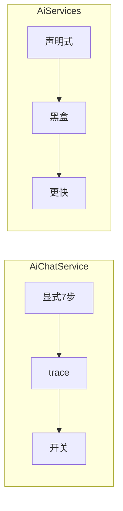
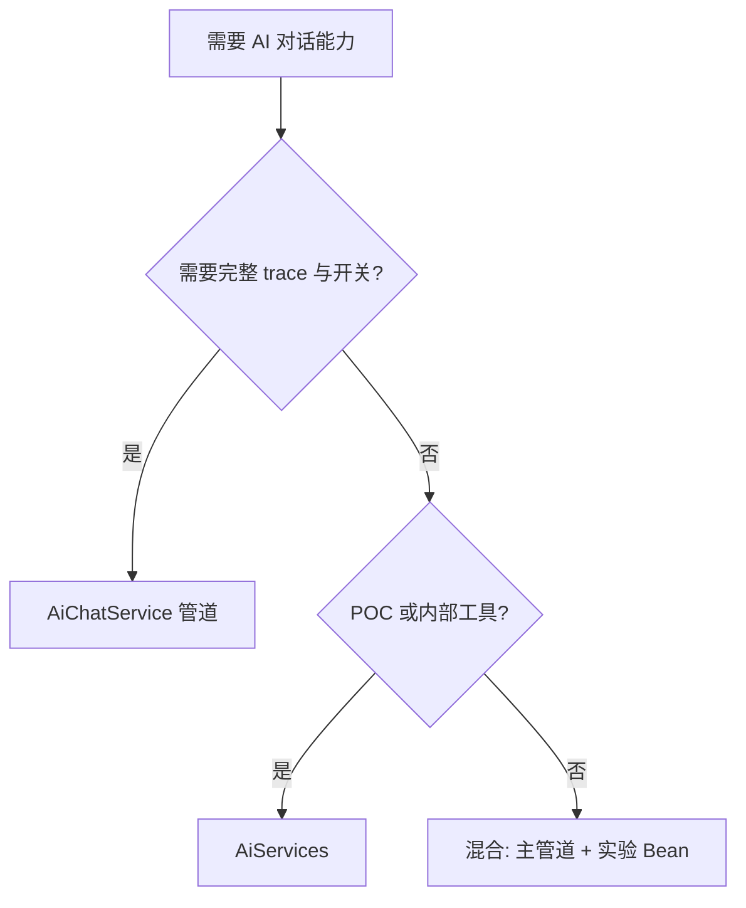

# 第 7 篇：AiServices vs AiChatService — 编排选型

> ai-customer-service 不是 LangChain4j 全家桶 Demo，而是 **「LC4J 作 Model Layer + Spring 自研编排」** 的可运行骨架。

**上一篇**：[第 6 篇](./06-tools.md) | **下一篇**：[第 8 篇：生产收尾](./08-streaming-production.md)

---

## 写在前面

LangChain4j 教程的「终点」往往是 `AiServices.builder()`。本仓库 **刻意不用** 它做生产主编排。本篇并排对比，帮你建立选型标准。

---

## 你将学到什么

- AiServices 最小示例
- AiChatService 七步管道
- 全换 AiServices 会丢失什么（对照 trace）
- 场景决策树
- 混合实验 Bean 写法

---

## 1. LangChain4j AiServices

```java
interface CustomerAssistant {
    @SystemMessage("你是专业 AI 客服助手。")
    String chat(@MemoryId String sessionId, @UserMessage String message);
}

CustomerAssistant bot = AiServices.builder(CustomerAssistant.class)
    .chatModel(model)
    .chatMemoryProvider(id -> MessageWindowChatMemory.withMaxMessages(20))
    .tools(new OrderTools())
    .retrievalAugmentor(augmentor)
    .build();

bot.chat("s1", "订单123何时发货？");
```

---

## 2. 项目：AiChatService

```java
// 7 步显式管道 — 见 AiChatService.chatWithTrace
history → route → rag? → tools? → prompt → llm → save
// 返回 ChatTurnTraceResult → ChatTraceResponse
```

### trace 与 UI 映射

| 字段 | 前端面板 |
|------|----------|
| `agentDecision` | AgentDecisionPanel |
| `ragContext` | RagContextPanel |
| `toolResult` | ToolResultPanel |
| `prompt` | PromptPanel |


---

## 3. 并排对比



| 维度 | AiChatService | AiServices |
|------|---------------|------------|
| 开发效率 | 低 | **高** |
| 可控性 | **高** | 低 |
| 可观测性 | **高** | 低 |
| POC | 慢 | **快** |

---

## 4. 场景决策树



| 场景 | 建议 |
|------|------|
| 本仓库 / 可观测客服 | **不用** AiServices 替换 |
| 内部 POC | **可用** |
| 生产 | **混合** |

---

## 5. 混合实验 Bean

```java
@Configuration
@ConditionalOnProperty("aics.experiment.aiservices-enabled")
class AiServicesExperimentConfig {
    @Bean
    CustomerAssistant experimentalAssistant(OpenAiChatModel model, OrderTools tools) {
        return AiServices.builder(CustomerAssistant.class)
            .chatModel(model).tools(tools).build();
    }
}
```

生产路径仍走 `CustomerChatFacade` → `AiChatService`。

---

## 动手验证：CapabilityChatFactory

[`CapabilityChatFactory`](../../ai-eval/src/main/java/com/aics/eval/support/CapabilityChatFactory.java) 无 Spring 装配五档：

```java
AiChatService full = CapabilityChatFactory.build(AiVersion.FULL, new RecordingLlmClient());
full.chat("eval", "我的订单123为什么还没有发货？");
```

```bash
mvn -pl ai-eval test -DskipTests=false -Dmaven.test.skip=false 2>/dev/null | tail -5
```

```text
# 或直接在 ai-service 运行 AiServiceEvolutionTest
Tests run: 4, Failures: 0, Errors: 0
```

---

## 全换 AiServices 会丢失

1. `AgentDecision` 结构化 trace  
2. `OrchestrationProperties` 开关  
3. `FallbackAgentRouter`  
4. `AiServiceEvolutionTest` 叙事  
5. 固定 Prompt 段落断言  

---

## FAQ

**Q：能否 AiChatService 内部包 AiServices？**  
A：不推荐，双重黑盒更难 debug。

---

## 本篇小结

> **快 vs 可控的权衡；本仓库选 AiChatService；AiServices 作 POC 工具。**

---

## 系列导航

[第 6 篇](./06-tools.md) | [第 8 篇](./08-streaming-production.md) | [README](./README.md)
