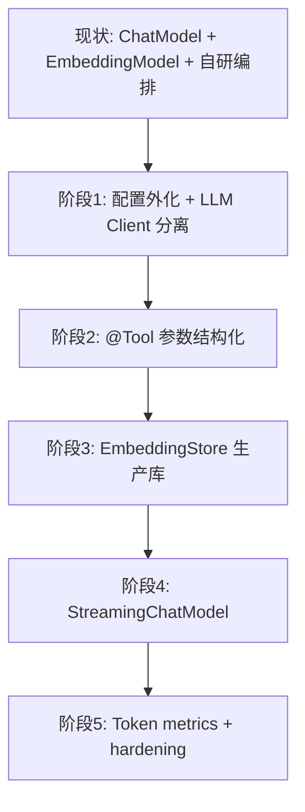

# 第 8 篇：Streaming、观测与生产演进路线图

> ai-customer-service 不是 LangChain4j 全家桶 Demo，而是 **「LC4J 作 Model Layer + Spring 自研编排」** 的可运行骨架。

**上一篇**：[第 7 篇：AiServices](./07-aiservices.md)

---

## 写在前面

系列在 **线性编排与 LangChain4j 薄集成** 之后，继续 **LangGraph4j 四阶段落地**（第 9–12 篇）。读完你应能列出从 Demo 到生产的改造清单。

---

## 你将学到什么

- `StreamingChatModel` vs 项目字符模拟 SSE
- SSE curl 与 UI 体验
- `expose-prompt-trace`、API Key、Resilience4j 限流
- 生产 checklist
- 全系列演进路线图

---

## 1. LangChain4j StreamingChatModel

```java
OpenAiStreamingChatModel streamingModel = OpenAiStreamingChatModel.builder()
    .apiKey(apiKey).modelName("gpt-4o-mini").build();

streamingModel.chat("你好", new StreamingChatResponseHandler() {
    @Override
    public void onPartialResponse(String token) { /* push SSE */ }
    @Override
    public void onCompleteResponse(ChatResponse r) { /* done */ }
    @Override
    public void onError(Throwable e) { /* error */ }
});
```

---

## 2. 项目现状：模拟流

[`ChatReactiveController`](../../ai-reactive-chat/src/main/java/com/aics/reactivechat/controller/ChatReactiveController.java)：

1. **完整**执行 `customerChatFacade.ask()`  
2. 对 `answer` **按字符** `delayElements(4ms)` 推送 SSE  

**不是** token 级真流式。

| | 模拟 SSE | StreamingChatModel |
|--|----------|-------------------|
| 首字延迟 | 等完整编排+生成 | **低** |
| 实现难度 | **低** | 中 |
| trace | 非流式接口提供 | 需拆分设计 |

### 推荐改造

- 编排前 5 步仍同步  
- 仅 `llm.chatStreaming(prompt, handler)` 流式  
- SSE：`event: trace` 然后 `event: token`


---

## 3. 观测体系

### 3.1 chatWithTrace

[`ChatTraceResponse`](../../ai-reactive-chat/src/main/java/com/aics/reactivechat/dto/ChatTraceResponse.java) ↔ 前端四面板。

### 3.2 配置

```yaml
# ai-reactive-chat — 开发
aics:
  observability:
    expose-prompt-trace: true
  security:
    api-key: ""

# 生产建议
aics:
  observability:
    expose-prompt-trace: false
  security:
    api-key: ${AICS_API_KEY}
```

### 3.3 Resilience4j

[`application.yml`](../../ai-reactive-chat/src/main/resources/application.yml)：

- `llm`：熔断 + 重试  
- `chat`：RateLimiter 120/min → **HTTP 429**

---

## 4. 生产 checklist

| 类别 | 项 | Demo 现状 | 生产建议 |
|------|-----|-----------|----------|
| LLM | 配置外化 | 硬编码 | `aics.llm.*` 环境变量 |
| LLM | Client 分离 | 共用 | router / chat 分离 |
| 安全 | prompt trace | true | **false** |
| 安全 | API Key | 空 | 启用 `X-API-Key` |
| 记忆 | 存储 | in-memory | **Redis** |
| RAG | 向量库 | in-memory | PG / Milvus + EmbeddingStore |
| 工具 | 入参 | regex | tool_calls |
| 流式 | SSE | 模拟 | **StreamingChatModel** |
| 观测 | token | 无 | Micrometer |

---

## 5. 全系列演进路线



**明确不建议**：整体替换为单个 `AiServices` Agent。

---

## 6. 全系列索引

| # | 标题 | 文件 |
|---|------|------|
| 1 | 系统架构与设计理念 | [01-system-architecture.md](./01-system-architecture.md) |
| 2 | LC4J 能力全景 × 使用矩阵 | [02-langchain4j-capability-matrix.md](./02-langchain4j-capability-matrix.md) |
| 3 | ChatModel | [03-chatmodel.md](./03-chatmodel.md) |
| 4 | EmbeddingModel + RAG | [04-embedding-rag.md](./04-embedding-rag.md) |
| 5 | ChatMemory | [05-chat-memory.md](./05-chat-memory.md) |
| 6 | Tools | [06-tools.md](./06-tools.md) |
| 7 | AiServices vs AiChatService | [07-aiservices.md](./07-aiservices.md) |
| 8 | **Streaming + 生产（本篇）** | [08-streaming-production.md](./08-streaming-production.md) |

### 推荐阅读路径

- **快速上手**：1 → 2 → 动手验证第 1 篇 curl  
- **已用 LC4J**：2 → 3 → 4  
- **未用 LC4J 为何**：2 → 5 → 6 → 7  
- **上线前**：8 + 第 3 篇改进项  

---

## 动手验证

### SSE 流式

```bash
curl -N -X POST http://localhost:8081/api/chat/stream \
  -H "Content-Type: application/json" \
  -H "Accept: text/event-stream" \
  -d '{"sessionId":"stream-demo","message":"用三句话介绍发货流程"}'
```

```text
# 预期：逐字符/逐段输出（非 JSON），例如：
您
好
，
订
单
…
（完整答案字符间约 4ms 间隔）
```

### 限流 429（压测示意）

快速连续请求超过 `limitForPeriod: 120` 可能得到：

```text
HTTP/1.1 429 Too Many Requests
请求过于频繁，请稍后再试
```

### Prometheus

```bash
curl -s http://localhost:8081/actuator/prometheus | grep resilience4j | head -5
```

```text
# 预期含 ratelimiter / circuitbreaker 相关指标名（视运行时而定）
resilience4j_ratelimiter_available_permissions{name="chat",...} 119.0
```

### 生产 yml 片段

```yaml
aics:
  observability:
    expose-prompt-trace: false
  security:
    api-key: ${AICS_API_KEY}
  llm:
    api-key: ${OPENAI_API_KEY}
    base-url: ${OPENAI_BASE_URL}
  memory:
    store: redis
  rag:
    vector-store: postgres
```

---

## 系列总结

> **ai-customer-service 展示 Java 企业团队在 LangChain4j 上的务实路径：LC4J 做 Model Layer，Spring 自研做编排、记忆、工具、RAG 存储与可观测性。演进时保留 AiChatService，分阶段引入 LC4J 单项能力。**

---

## 系列导航

| 链接 |
|------|
| [第 9 篇：LangGraph4j 落地（一）](./09-langgraph4j-phase1-graph.md) |
| [系列索引 README](./README.md) |
| [发布规范 PUBLISHING.md](./PUBLISHING.md) |
| [截图清单 assets/README.md](./assets/README.md) |
| [项目 README](../../README.md) |

**本篇为「线性编排」收官；LangGraph4j 四阶段见第 9–12 篇。**
