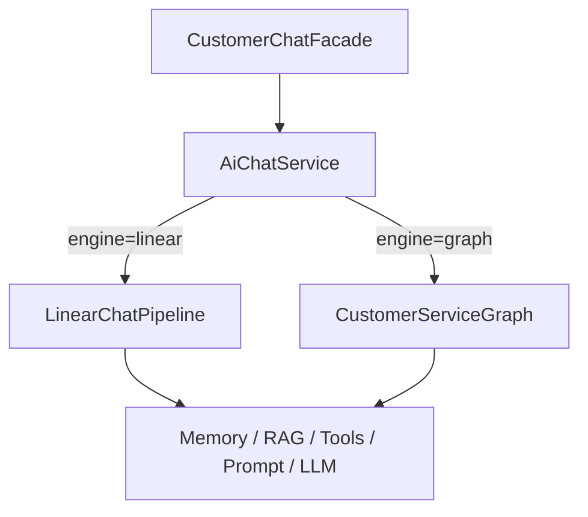
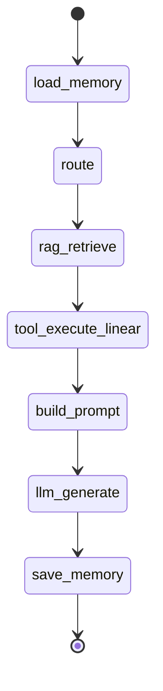

# 第 9 篇：LangGraph4j 落地（一）— 图编排骨架与线性管道等价迁移

> 系列第 7 篇我们刻意不用 LangChain4j `AiServices` 做主编排。本篇开始 **四阶段 LangGraph4j 演进**：先在 Java 侧引入 **状态图**，但不破坏现有 trace 与 SPI 边界。

**上一篇**：[第 8 篇：Streaming 与生产](./08-streaming-production.md) | **下一篇**：[第 10 篇：ReAct 多步工具](./10-langgraph4j-phase2-react.md)

---

## 写在前面

当客服场景从「单轮问答」走向「查订单 → 判断 → 建工单 → 人工审核」时，**线性七步管道** 的表达力不够，但 **一把梭换成 AiServices** 又会丢掉调试面板与产品开关。

LangGraph4j 提供了第三条路：**图编排 + 显式节点 + checkpoint/interrupt**，且与 Spring、LangChain4j 同栈。

Phase 1 的目标很克制：**行为等价**——`engine=graph` 时，对外 `ChatTurnTraceResult` 与旧 `AiChatService` 一致；`engine=linear` 可随时回退。

---

## 你将学到什么

- 为什么选 LangGraph4j 而不是 Python LangGraph  sidecar
- `ai-graph` 模块结构与 `ChatGraphState` 设计
- `CustomerServiceGraph` 如何把 SPI 包成节点
- `OrchestrationProperties.engine` 双引擎开关
- `GraphOrchestrationEquivalenceTest` 怎么做回归

---

## 1. 背景：七步管道遇到了什么天花板

原编排入口 [`AiChatService`](../../ai-service/src/main/java/com/aics/service/chat/AiChatService.java)（Phase 1 前）是固定顺序：

```text
load memory → route → rag? → tool? → build prompt → LLM → save memory
```

优点：trace 清晰、每步可测、与前端 Agent 面板一一对应。

局限：

| 局限 | 业务影响 |
|------|----------|
| 单次工具 | 无法「查订单再建工单」 |
| 路由与主 LLM 分离 | 固定 2 次模型调用 |
| 无条件分支 | 售前/售后/投诉无法走不同子流程 |
| 无 interrupt | 敏感操作无法等人点头 |

LangGraph4j 补的是 **编排表达力**；LangChain4j 仍只负责 **Model Layer**（`LlmClient` / `StreamingLlmClient`）。

---

## 2. 为什么用 LangGraph4j（Java 版）

| 方案 | 优点 | 缺点 |
|------|------|------|
| 继续手写 if-else 管道 | 简单 | 复杂流程不可维护 |
| LangChain4j AiServices | 开发快 | trace 黑盒（见第 7 篇） |
| Python LangGraph 微服务 | 官方生态全 | 双运行时、契约维护成本高 |
| **LangGraph4j** | 与 Spring 同栈、支持 interrupt/checkpoint | 需学习 StateGraph API |

本项目为 **Java 17 + Spring Boot 3.3** 多模块骨架，选用 **LangGraph4j 1.8.x**（BOM 锁定于 `ai-parent`）。

---

## 3. Phase 1 架构：只换编排层



**不变的部分**：

- HTTP：`ChatReactiveController`（8081）
- 门面：`CustomerChatFacade`（限流）
- SPI：`ChatMemory`、`KnowledgeRetriever`、`ToolExecutor`、`PromptComposer`、`LlmClient`
- 对外契约：`ChatTurnTraceResult` → `ChatTraceResponse` → 前端 Agent 面板

**新增模块**：`ai-graph`（图定义、状态、节点、配置）

---

## 4. ChatGraphState：图状态与 trace 对齐

[`ChatGraphState`](../../ai-graph/src/main/java/com/aics/graph/state/ChatGraphState.java) 继承 LangGraph4j `AgentState`，用 `Channel` 描述字段合并策略：

- 普通字段：`Channels.base((old, neu) -> neu)` 覆盖写
- `executedNodes`：`Channels.appender` 追加（用于图轨迹）

核心字段与 trace 映射：

| 状态键 | trace 字段 |
|--------|------------|
| `routerDecision` | `agentDecision` |
| `ragUsed` / `ragContext` | RAG 面板 |
| `toolResult` / `toolCalls` | Tool 面板 |
| `prompt` | Prompt 面板 |
| `answer` | 助手回复 |
| `executedNodes` | Graph 轨迹（Phase 4 前端展示） |

节点原则：**薄包装**——只读写 state，调用 SPI Bean，不写业务 if-else 泥潭。逻辑集中在 [`GraphNodes`](../../ai-graph/src/main/java/com/aics/graph/nodes/GraphNodes.java)。

---

## 5. CustomerServiceGraph：Phase 1 等价图

[`CustomerServiceGraph`](../../ai-graph/src/main/java/com/aics/graph/CustomerServiceGraph.java) 在 Phase 1 等价于线性管道（`react-enabled: false` 时走 `tool_execute_linear`）：



构建方式（节选）：

```java
var graph = new StateGraph<>(ChatGraphState.SCHEMA, ChatGraphState::new)
    .addNode("load_memory", node_async(nodes::loadMemory))
    .addNode("route", node_async(nodes::route))
    // ...
    .addEdge(START, "load_memory")
    .addEdge("save_memory", END);
CompiledGraph<ChatGraphState> compiled = graph.compile(compileConfig());
```

`invoke(sessionId, message, context)` 返回最终 `ChatGraphState`，由 `AiChatService` 映射为 `ChatTurnTraceResult`。

---

## 6. 双引擎开关：linear 与 graph 并存

[`OrchestrationProperties`](../../ai-service/src/main/java/com/aics/service/config/OrchestrationProperties.java) 新增：

```yaml
aics:
  orchestration:
    engine: graph   # linear | graph
```

[`LinearChatPipeline`](../../ai-service/src/main/java/com/aics/service/chat/LinearChatPipeline.java) 保留原七步实现，用于：

1. **回滚**：生产事故时一行配置切回 `linear`
2. **对比测试**：同一 fixture 下断言 graph 与 linear 等价

[`AiChatService`](../../ai-service/src/main/java/com/aics/service/chat/AiChatService.java) 委托逻辑：

```java
if (orchestrationProperties.getEngine() == OrchestrationEngine.GRAPH) {
    return fromGraphState(customerServiceGraph.invoke(...));
}
return linearChatPipeline.chatWithTrace(...);
```

---

## 7. 动手验证

### 7.1 编译与等价性测试

```bash
cd ai-customer-service
mvn -pl ai-service -am test -DskipTests=false -Dmaven.test.skip=false
```

关注：

```text
GraphOrchestrationEquivalenceTest ... OK
AiServiceEvolutionTest ............ OK
```

[`GraphOrchestrationEquivalenceTest`](../../ai-service/src/test/java/com/aics/service/evolution/GraphOrchestrationEquivalenceTest.java) 断言：`answer`、`ragUsed`、`toolsUsed`、`toolResult`、`prompt` 在 linear/graph 下一致。

### 7.2 运行时切换引擎

`ai-reactive-chat/src/main/resources/application.yml`：

```yaml
aics:
  orchestration:
    engine: graph   # 改为 linear 可即时回退
```

启动聊天服务：

```bash
mvn -pl ai-reactive-chat spring-boot:run
```

```bash
curl -s -X POST http://localhost:8081/api/chat \
  -H "Content-Type: application/json" \
  -d '{"sessionId":"lg-phase1","message":"我的订单123为什么还没发货？"}' | jq .
```

开发环境 `expose-prompt-trace: true` 时，响应仍含 `agentDecision`、`ragContext`、`toolResult`、`prompt`——前端四个 Agent 面板无需改动。

---

## 8. Phase 1 踩坑笔记

### 8.1 AgentDecision 与 checkpoint 序列化

启用 `interrupt` + checkpoint 时，状态中的对象需 `Serializable`。`AgentDecision`、`OrchestrationContext`、`ToolCallRecord` 已实现该接口。

### 8.2 Channel API

LangGraph4j 1.8.x 使用 `Channels.base(reducer)`，不是早期示例里的 `Channel.of(...)`。以 BOM 锁定版本为准。

### 8.3 不要一次改太多

Phase 1 **禁止** 同时上 ReAct、工单、interrupt。先等价，再演进——这是本系列四篇的分期原则。

---

## FAQ

**Q：Phase 1 后还要保留 LinearChatPipeline 吗？**  
A：建议长期保留。它是回归基线与事故回滚路径。

**Q：图编排会不会比线性慢？**  
A：节点本身是同步 SPI 调用，开销主要在 LangGraph4j 调度。Phase 1 等价路径下差异可忽略；瓶颈仍在 LLM。

**Q：和 AiServices 冲突吗？**  
A：不冲突。图编排是 **显式节点**；AiServices 仍可作为 POC Bean（第 7 篇），不替换主管道。

---

## 本篇小结

> Phase 1 用 **LangGraph4j 状态图** 1:1 接住原七步管道，通过 **`engine=linear|graph`** 保证可回退、可对比。SPI 与 trace 契约未动，为 Phase 2 ReAct、Phase 3 工单集成、Phase 4 interrupt 留出干净边界。

---

## 系列导航

[第 8 篇](./08-streaming-production.md) | [第 10 篇：ReAct 多步工具](./10-langgraph4j-phase2-react.md) | [README](./README.md)
