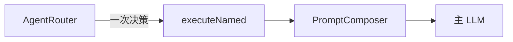
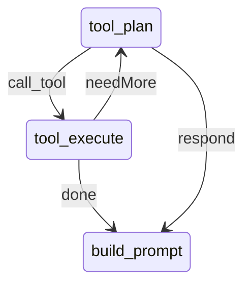

# 第 10 篇：LangGraph4j 落地（二）— ReAct 多步工具与 trace 扩展

> Phase 1 让图编排 **行为等价** 于线性管道。Phase 2 才开始发挥图的真正价值：**多步工具循环**。

**上一篇**：[第 9 篇：图编排骨架](./09-langgraph4j-phase1-graph.md) | **下一篇**：[第 11 篇：外部系统集成](./11-langgraph4j-phase3-integrations.md)

---

## 写在前面

真实客服里常见链路：

```text
用户：订单 123 一直没到，我要投诉
  → order_query(123)
  → 判断物流异常
  → ticket_create(投诉工单)
  → 生成回复
```

第 6 篇的 `AgentRouter` + **单次** `executeNamed` 无法表达这条链。Phase 2 引入 **ReAct 子循环**：LLM 规划 → 执行工具 → 再规划，直到 `respond` 或达到循环上限。

---

## 你将学到什么

- `tool_plan` / `tool_execute` 条件边如何闭合
- `ToolCallRecord` 与多步 prompt 渲染
- graph 模式下 Router 如何「降级」为意图标签
- 前端 `toolCalls` 时间线展示
- `max-tool-loops` 防死循环

---

## 1. 从单次工具到 ReAct 循环

### 1.1 线性时代的限制



- Router LLM **+** 主 LLM = 至少 2 次调用
- `toolName` 只能选一个
- trace 里只有一个 `toolResult` 字符串

### 1.2 Phase 2 目标结构



配置开关：`aics.orchestration.graph.react-enabled: true`（默认已开）。

---

## 2. 图状态扩展

[`ChatGraphState`](../../ai-graph/src/main/java/com/aics/graph/state/ChatGraphState.java) 新增：

| 字段 | 含义 |
|------|------|
| `toolCalls` | `List<ToolCallRecord>` 多步历史 |
| `toolLoopCount` | 当前循环次数 |
| `aggregatedToolResult` | 合并后的工具输出 |
| `nextToolAction` | `call_tool` / `respond` |
| `nextToolName` / `nextToolInput` | 规划结果 |

[`ToolCallRecord`](../../ai-common/src/main/java/com/aics/model/ToolCallRecord.java) 定义在 `ai-common`，供编排 trace 与前端共用：

```java
public record ToolCallRecord(
    String name, String input, String output, Instant timestamp
) implements Serializable { }
```

---

## 3. ToolPlanNode：LLM 输出结构化 JSON

[`GraphNodes.toolPlan`](../../ai-graph/src/main/java/com/aics/graph/nodes/GraphNodes.java) 将以下上下文发给 LLM：

- 会话 `history` + 当前 `message`
- 已通过 [`ToolCatalog`](../../ai-common/src/main/java/com/aics/spi/ToolCatalog.java) 列举的 **可用工具清单**
- 已有 `toolCalls` 历史

期望 JSON：

```json
{"action":"call_tool","toolName":"order_query","toolInput":"订单123"}
```

或：

```json
{"action":"respond","toolName":"","toolInput":""}
```

终止条件：

1. `action == respond`
2. `toolLoopCount >= max-tool-loops`（默认 5，配置项 `aics.orchestration.graph.max-tool-loops`）

解析失败时 **安全回退** 为 `respond`，避免图卡死。

---

## 4. Router 在 graph 模式下的角色变化

当 `react-enabled: true` 时：

- **不再** 为每次对话单独走 `LlmAgentRouter` 的 JSON 决策（避免双 LLM）
- `route` 节点改为 **启发式意图标签**：`consult` / `order` / `complaint` / `escalate`
- 意图供 Phase 4 子图路由与 trace 展示

`agent-router-llm-enabled` 在 graph + react 场景下让位于 **tool_plan 内的规划 LLM**。

---

## 5. Prompt 与 trace 契约扩展

### 5.1 PromptComposer 多步 overload

[`PromptComposer`](../../ai-common/src/main/java/com/aics/spi/PromptComposer.java) 新增带 `List<ToolCallRecord>` 的 `build(...)` 默认方法；[`DefaultPromptComposer`](../../ai-prompt/src/main/java/com/aics/prompt/composer/DefaultPromptComposer.java) 将多步结果渲染为编号列表：

```text
### 工具结果
[1] order_query
{...json...}

[2] ticket_create
{...json...}
```

旧四参数 `build` **保留**，线性管道与单步场景无感。

### 5.2 ChatTurnTraceResult

[`ChatTurnTraceResult`](../../ai-service/src/main/java/com/aics/service/chat/dto/ChatTurnTraceResult.java) 扩展字段：

- `toolCalls`
- `executedNodes`
- `graphExecutionId`
- `durationMs`
- `pendingApproval` / `approvalToken`（Phase 4 使用）

[`ChatTraceResponse`](../../ai-reactive-chat/src/main/java/com/aics/reactivechat/dto/ChatTraceResponse.java) 同步扩展 `toolCalls` 视图。

### 5.3 前端 ToolResultPanel

[`ToolResultPanel`](../../../ai-customer-front/src/components/agent/ToolResultPanel.tsx) 优先渲染 `toolCalls` 列表；无多步数据时回退展示 `toolResult` 字符串。

---

## 6. 动手验证

### 6.1 配置确认

```yaml
aics:
  orchestration:
    engine: graph
    graph:
      react-enabled: true
      max-tool-loops: 5
```

### 6.2 触发多步工具（示例话术）

```bash
curl -s -X POST http://localhost:8081/api/chat \
  -H "Content-Type: application/json" \
  -d '{"sessionId":"react-demo","message":"订单ORD-123一直没收到，帮我查一下并创建投诉工单"}' \
  | jq '{toolCalls, executedNodes, toolResult}'
```

在 demo 模型与 mock 工具下，期望 `executedNodes` 含 `tool_plan`、`tool_execute` 等；`toolCalls` 数组长度 ≥ 1（具体取决于 LLM 规划）。

### 6.3 循环上限

将 `max-tool-loops` 设为 `1`，观察日志出现 `tool loop limit reached`，图强制进入 `build_prompt`。

---

## 7. 与第 6 篇 Tools 设计的关系

| 维度 | 第 6 篇（Router 分离） | Phase 2（ReAct） |
|------|------------------------|------------------|
| 工具次数 | 1 次 | 多次循环 |
| 决策方 | 独立 Router LLM | tool_plan LLM |
| 审计 | `agentDecision` + `toolResult` | + `toolCalls[]` 时间线 |
| 适用 | 简单演示 | 工单/订单链式场景 |

**ToolRegistry 未改**：新工具仍是 Spring Bean 自动注册（第 11 篇工单工具同理）。

---

## FAQ

**Q：ReAct 会不会无限调工具？**  
A：`max-tool-loops` + `max-steps`（图递归上限）双重保护。

**Q：linear 引擎支持多步吗？**  
A：不支持。多步是图编排能力；linear 保留单步基线。

**Q：tool_plan 的 JSON 不稳怎么办？**  
A：解析失败回退 `respond`；生产可换更强模型或加 JSON schema 约束（后续可增强）。

---

## 本篇小结

> Phase 2 用 **tool_plan ↔ tool_execute** 闭合 ReAct 循环，把「一次 Router + 一次工具」升级为 **可审计的多步工具链**，并通过 `toolCalls` 扩展 trace 与前端面板。

---

## 系列导航

[第 9 篇](./09-langgraph4j-phase1-graph.md) | [第 11 篇：外部系统集成](./11-langgraph4j-phase3-integrations.md) | [README](./README.md)
