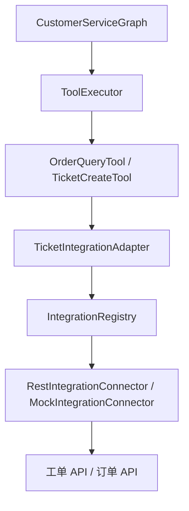

# 第 11 篇：LangGraph4j 落地（三）— 可扩展外部系统集成层

> 图编排解决 **怎么走**；外部系统解决 **调谁**。Phase 3 把工单、订单从演示 JSON 升级为 **可插拔 Connector 层**。

**上一篇**：[第 10 篇：ReAct 多步工具](./10-langgraph4j-phase2-react.md) | **下一篇**：[第 12 篇：HITL 与真流式](./12-langgraph4j-phase4-advanced.md)

---

## 写在前面

第 6 篇的 [`OrderQueryTool`](../../ai-tools/src/main/java/com/aics/tools/builtin/OrderQueryTool.java) 返回固定演示数据。对接真实工单系统时，常见反模式是：

- 在 `Tool.execute` 里直接写 `WebClient` + URL
- 每接一个系统改一次 `AiChatService` 或图节点

Phase 3 采用 **Connector SPI + Adapter + Tool** 三层，编排图 **零修改** 即可换后端。

---

## 你将学到什么

- `ai-integrations` 模块分层
- `IntegrationConnector` 与三种扩展方式
- YAML 配置 REST Connector
- `TicketIntegrationAdapter` / `OrderIntegrationAdapter`
- 工单工具与 WireMock 测试

---

## 1. 设计原则：Tool 与 Connector 解耦



| 层 | 职责 | 变更频率 |
|----|------|----------|
| **Tool** | LLM 可见的工具面、入参解析 | 随业务话术 |
| **Adapter** | 领域友好 API（`create`/`get`/`query`） | 随领域模型 |
| **Connector** | HTTP/SDK/Mock 访问 | 随厂商/环境 |
| **Registry** | 按 `connectorId` 查找 | 启动时注册 |

---

## 2. Connector SPI

[`IntegrationConnector`](../../ai-integrations/src/main/java/com/aics/integrations/spi/IntegrationConnector.java)：

```java
public interface IntegrationConnector {
    String id();           // ticket-service
    String type();         // rest | mock | jira | ...
    boolean supports(String operation);
    IntegrationResponse execute(String operation, IntegrationRequest request);
}
```

[`IntegrationRegistry`](../../ai-integrations/src/main/java/com/aics/integrations/spi/IntegrationRegistry.java) 在 Spring 启动时收集所有 Connector Bean。

---

## 3. 三种扩展方式（由易到难）

### 3.1 零代码：YAML 配置 REST

[`IntegrationsProperties`](../../ai-integrations/src/main/java/com/aics/integrations/config/IntegrationsProperties.java) + [`RestIntegrationConnector`](../../ai-integrations/src/main/java/com/aics/integrations/connector/RestIntegrationConnector.java)：

```yaml
aics:
  integrations:
    default-timeout: 5s
    ticket-connector-id: ticket-service
    order-connector-id: order-service
    connectors:
      ticket-service:
        type: rest
        base-url: http://ticket-api.internal
        auth:
          type: bearer
          token: ${TICKET_API_TOKEN:}
        operations:
          create:
            method: POST
            path: /api/v1/tickets
          query:
            method: GET
            path: /api/v1/tickets/{ticketId}
      order-service:
        type: rest
        base-url: http://order-api.internal
        operations:
          query:
            method: GET
            path: /api/v1/orders/{orderId}
```

换环境只改配置，**Tool 与图编排不动**。

### 3.2 继承 RestIntegrationConnector

覆盖鉴权、响应解析、错误映射——适合「基本是 REST 但 header 特殊」的系统。

### 3.3 实现 IntegrationConnector

对接 Jira SDK、Zendesk、MCP Server 等；注册为 Spring Bean 即可被 `IntegrationRegistry` 发现。

---

## 4. Mock Connector：本地开发与测试

未配置 `connectors` 时，[`IntegrationsAutoConfiguration`](../../ai-integrations/src/main/java/com/aics/integrations/config/IntegrationsAutoConfiguration.java) 默认注册：

- `ticket-service`（mock）：`create` / `query`
- `order-service`（mock）：`query`

[`MockIntegrationConnector`](../../ai-integrations/src/main/java/com/aics/integrations/connector/MockIntegrationConnector.java) 返回固定 JSON，无需外部依赖即可跑通 ReAct + 工单链。

当前 `ai-reactive-chat` 默认即 mock：

```yaml
aics:
  integrations:
    connectors:
      ticket-service:
        type: mock
      order-service:
        type: mock
```

---

## 5. Adapter 层：Tool 不碰 HTTP

[`TicketIntegrationAdapter`](../../ai-integrations/src/main/java/com/aics/integrations/adapter/TicketIntegrationAdapter.java)：

```java
public TicketDto create(CreateTicketRequest request) {
    IntegrationResponse response = registry.require(connectorId)
        .execute("create", IntegrationRequest.ofBody(...));
    // 解析 JSON → TicketDto
}
```

[`OrderIntegrationAdapter`](../../ai-integrations/src/main/java/com/aics/integrations/adapter/OrderIntegrationAdapter.java) 从用户输入提取订单号，调用 `query` 操作。

Connector ID 可通过配置切换：

```yaml
aics:
  integrations:
    ticket-connector-id: ticket-service
```

---

## 6. 工具改造

| 工具 | 变更 |
|------|------|
| [`OrderQueryTool`](../../ai-tools/src/main/java/com/aics/tools/builtin/OrderQueryTool.java) | 注入 `OrderIntegrationAdapter` |
| [`TicketCreateTool`](../../ai-tools/src/main/java/com/aics/tools/builtin/TicketCreateTool.java) | 新增，调 `ticket_create` |
| [`TicketQueryTool`](../../ai-tools/src/main/java/com/aics/tools/builtin/TicketQueryTool.java) | 新增，查询工单状态 |

[`ToolRegistry`](../../ai-tools/src/main/java/com/aics/tools/registry/ToolRegistry.java) **无需修改**——新 `@Component` 自动入表。

[`RegistryToolCatalog`](../../ai-tools/src/main/java/com/aics/tools/spi/RegistryToolCatalog.java) 为 Phase 2 的 `tool_plan` 提供工具清单。

---

## 7. 测试：WireMock 验证 REST 映射

[`RestIntegrationConnectorTest`](../../ai-integrations/src/test/java/com/aics/integrations/connector/RestIntegrationConnectorTest.java) 启动 WireMock，断言：

```text
GET /api/v1/orders/ORD-123 → 200 + JSON body
```

```bash
mvn -pl ai-integrations test -DskipTests=false -Dmaven.test.skip=false
```

---

## 8. 新增外部系统 checklist（不改图）

以接入 **自研 CRM 客户查询** 为例：

1. **YAML** 增加 `crm-service` connector（或写 `CrmConnector` 实现类）
2. （可选）新增 `CrmIntegrationAdapter`
3. 新增 `CustomerProfileTool` implements `Tool`
4. 重启服务——`tool_plan` 自动从 `ToolCatalog` 看到新工具

**不需要** 修改 `CustomerServiceGraph` 边或节点。

---

## 9. 生产注意事项（规划项）

Phase 3 代码已留扩展点；以下可在上线前补强：

| 项 | 建议 |
|----|------|
| 韧性 | Connector 级 Resilience4j 熔断/重试（对齐 LLM 出站配置） |
| 密钥 | `auth.token` 走环境变量，不入库 |
| 脱敏 | Tool 返回 JSON 掩码手机号/身份证 |
| 超时 | `default-timeout` 按 SLA 调整 |

---

## FAQ

**Q：为什么不直接在 Tool 里调 WebClient？**  
A：短期快，长期 N 个系统 × M 个工具会复制粘贴 HTTP 逻辑；Connector 统一出站。

**Q：linear 引擎能用新工具吗？**  
A：能。集成层与 `engine` 无关；linear 仅单步调用第一个 Router 选中的工具。

**Q：如何从 mock 切到真实 API？**  
A：把 `type: mock` 改为 `type: rest` 并填写 `base-url`，或实现厂商 Connector。

---

## 本篇小结

> Phase 3 用 **Connector SPI + YAML REST + Adapter** 把工单/订单接到工具层下面，实现 **编排图稳定、集成层可扩展**。新增外部系统走「配置或 Connector → Adapter → Tool」三步。

---

## 系列导航

[第 10 篇](./10-langgraph4j-phase2-react.md) | [第 12 篇：HITL 与真流式](./12-langgraph4j-phase4-advanced.md) | [README](./README.md)
