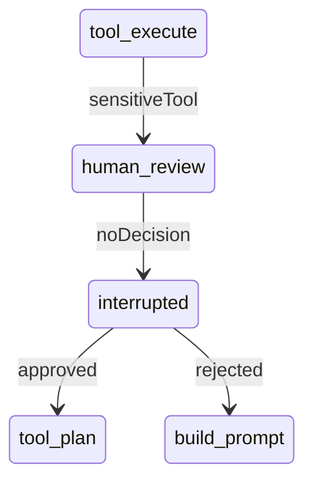
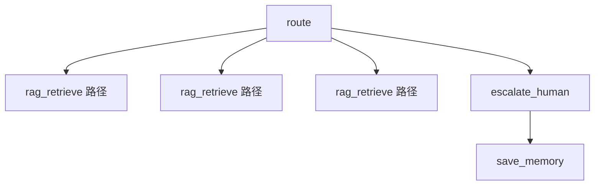
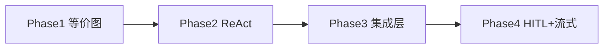

# 第 12 篇：LangGraph4j 落地（四）— HITL、子图、Checkpoint 与真流式

> 四篇系列的收官篇：把「能跑的多步客服」变成「可审批、可分流、可流式、可恢复」的生产形态。

**上一篇**：[第 11 篇：外部系统集成](./11-langgraph4j-phase3-integrations.md) | **系列索引**：[README](./README.md)

---

## 写在前面

Phase 1–3 解决了：**图编排**、**多步工具**、**外部系统**。生产客服还缺四块：

1. 敏感工单需要 **人工点头**（Human-in-the-loop）
2. 售前/投诉/转人工需要 **不同子流程**
3. 中断后要 **checkpoint 恢复**
4. 用户侧要 **真流式 SSE**，不是打字机模拟

Phase 4 在 **不破坏 trace 契约** 的前提下补齐上述能力。

---

## 你将学到什么

- `human_review` + LangGraph4j `interruptBefore`
- `POST /api/chat/resume` 审批恢复
- 意图子图：`consult` / `order` / `complaint` / `escalate`
- checkpoint：`memory` 与 Redis 占位
- `StreamingLlmClient` 与流式端点改造
- 前端 `GraphTracePanel`

---

## 1. Human-in-the-loop：敏感工单审批

### 1.1 流程



敏感工具默认：`ticket_create`（配置 `aics.orchestration.graph.approval.sensitive-tools`）。

[`GraphNodes.afterToolExecuteReact`](../../ai-graph/src/main/java/com/aics/graph/nodes/GraphNodes.java) 在执行敏感工具后路由到 `human_review`。

### 1.2 interrupt 与 checkpoint

[`CustomerServiceGraph.compileConfig`](../../ai-graph/src/main/java/com/aics/graph/CustomerServiceGraph.java) 在 `approval.enabled: true` 时：

```java
CompileConfig.builder()
    .checkpointSaver(checkpointSaver)
    .interruptBefore("human_review")
    .recursionLimit(maxSteps)
    .build();
```

- `thread_id` = `sessionId`
- 中断时 state 持久化到 `MemorySaver`（或 [`RedisGraphCheckpointSaver`](../../ai-graph/src/main/java/com/aics/graph/checkpoint/RedisGraphCheckpointSaver.java) 占位）

### 1.3 对外 API

**聊天响应** 扩展字段：

- `pendingApproval: true`
- `approvalToken: "<uuid>"`

**恢复接口** [`POST /api/chat/resume`](../../ai-reactive-chat/src/main/java/com/aics/reactivechat/controller/ChatReactiveController.java)：

```bash
curl -s -X POST http://localhost:8081/api/chat/resume \
  -H "Content-Type: application/json" \
  -d '{
    "sessionId": "hitl-demo",
    "approvalToken": "<上一步返回的 token>",
    "decision": "approved"
  }' | jq .
```

[`CustomerChatFacade.resumeWithApproval`](../../ai-service/src/main/java/com/aics/service/chat/CustomerChatFacade.java) → `AiChatService` → `CustomerServiceGraph.resume` 更新 state 后继续执行。

`decision` 为 `rejected` 时进入 `build_prompt`，由 LLM 向用户解释未执行操作。

---

## 2. 意图子图路由

`route` 节点写入 `intent` 标签后，[`routeByIntent`](../../ai-graph/src/main/java/com/aics/graph/nodes/GraphNodes.java) 分发：

| intent | 行为 |
|--------|------|
| `consult` | 常规定义：RAG + ReAct |
| `order` | 订单类话术，倾向 `order_query` |
| `complaint` | 投诉类，倾向 `ticket_create` + 可能 HITL |
| `escalate` | 走 `escalate_human` 节点，跳过主 LLM |



开关：`aics.orchestration.graph.sub-graph.enabled: true`。

当前实现为 **条件边分流**（单图多路径）；后续可演进为 LangGraph4j **subgraph** 独立编译。

---

## 3. Checkpoint 配置

```yaml
aics:
  orchestration:
    graph:
      checkpoint:
        store: memory   # memory | redis
```

- **memory**：[`MemorySaver`](https://langgraph4j.github.io/langgraph4j/)，开发/单测
- **redis**：`RedisGraphCheckpointSaver` 当前委托 MemorySaver，生产可替换为真实 Redis 持久化

注意：checkpoint 仅在 **approval 启用** 时挂载到 `CompileConfig`，避免无谓序列化开销。

---

## 4. 真流式 SSE

第 8 篇曾描述 **字符 delay 模拟流式**。Phase 4 改为：

### 4.1 StreamingLlmClient

[`StreamingLlmClient`](../../ai-common/src/main/java/com/aics/spi/StreamingLlmClient.java) 扩展 `LlmClient`：

```java
void stream(String prompt, Consumer<String> onChunk);
```

[`OpenAiLlmClient`](../../ai-core/src/main/java/com/aics/core/llm/OpenAiLlmClient.java) 注入 `OpenAiStreamingChatModel`，[`ResilientLlmClient`](../../ai-core/src/main/java/com/aics/core/llm/ResilientLlmClient.java) 透传流式能力。

### 4.2 编排与流式分离

[`CustomerServiceGraph.invokeUntilPrompt`](../../ai-graph/src/main/java/com/aics/graph/CustomerServiceGraph.java) 编译 **止于 `build_prompt` 的子图**；流式路径：

```text
invokeUntilPrompt → StreamingLlmClient.stream(prompt) → saveAnswer
```

[`AiChatService.chatStream`](../../ai-service/src/main/java/com/aics/service/chat/AiChatService.java) 对 graph / linear 引擎均支持；无流式实现时回退为一次性 `chat()`。

### 4.3 HTTP 端点

[`POST /api/chat/stream`](../../ai-reactive-chat/src/main/java/com/aics/reactivechat/controller/ChatReactiveController.java) 通过 `Flux.create` 推送真实 token 块（仍无 trace；调试走 `/api/chat`）。

---

## 5. 可观测与前端

### 5.1 trace 扩展

`ChatTurnTraceResult` / `ChatTraceResponse` 新增：

- `executedNodes` — 节点执行序列
- `graphExecutionId` / `durationMs`
- `pendingApproval` / `approvalToken`

### 5.2 GraphTracePanel

前端 [`GraphTracePanel`](../../../ai-customer-front/src/components/agent/GraphTracePanel.tsx) 展示：

- 节点 chips（`load_memory` → `route` → …）
- 执行耗时
- 等待审批状态

[`AssistantAgentBlock`](../../../ai-customer-front/src/components/agent/AssistantAgentBlock.tsx) 在 Tool/RAG 面板下方挂载该组件。

---

## 6. 四阶段总览



| Phase | 模块 | 关键词 |
|-------|------|--------|
| 1 | `ai-graph` | `engine=linear\|graph`、等价测试 |
| 2 | `ai-graph` + `ai-common` | `tool_plan` 循环、`toolCalls` |
| 3 | `ai-integrations` + `ai-tools` | Connector SPI、工单/订单 |
| 4 | `ai-graph` + `ai-core` + 前端 | interrupt、子图、真 SSE |

**默认配置** 见 [`ai-reactive-chat/application.yml`](../../ai-reactive-chat/src/main/resources/application.yml)：`engine: graph`，`react-enabled: true`，`approval.enabled: true`。

---

## 7. 动手验证清单

```bash
# 1. 全量构建与测试
cd ai-customer-service
mvn -pl ai-reactive-chat -am package -DskipTests=false -Dmaven.test.skip=false

# 2. 启动
mvn -pl ai-reactive-chat spring-boot:run

# 3. 非流式 + trace
curl -s -X POST http://localhost:8081/api/chat \
  -H "Content-Type: application/json" \
  -d '{"sessionId":"p4","message":"我要投诉订单123"}' \
  | jq '{executedNodes, pendingApproval, approvalToken, toolCalls}'

# 4. 流式（仅文本）
curl -N -X POST http://localhost:8081/api/chat/stream \
  -H "Content-Type: application/json" \
  -H "Accept: text/event-stream" \
  -d '{"sessionId":"p4-stream","message":"你好"}'
```

前端开发服务器联调时，打开 Agent 调试区应能看到 **Graph 执行轨迹** 与 **多步 Tool 列表**。

---

## 8. 后续演进（未在本仓库落地）

| 方向 | 说明 |
|------|------|
| LangGraph4j Studio | `profile=graph-studio` 可视化调试 |
| Micrometer 节点耗时 | `aics.graph.node.*` 指标 |
| ai-eval 图编排对比 | linear vs graph vs graph+react 档位报告 |
| 真 Redis checkpoint | 替换 `RedisGraphCheckpointSaver` 委托实现 |
| `/api/chat/stream/trace` | SSE 第二通道推送节点事件 |

---

## FAQ

**Q：生产要不要默认开 approval？**  
A：视合规要求。高敏工单建议开；纯咨询 Bot 可 `approval.enabled: false`。

**Q：interrupt 后用户换一句话再说怎么办？**  
A：当前 `thread_id=sessionId`；新消息会新起一轮。生产可增加「放弃审批」API 清理 checkpoint。

**Q：还需要 LinearChatPipeline 吗？**  
A：要。事故回滚与等价回归仍依赖 `engine: linear`。

---

## 本篇小结

> Phase 4 让 LangGraph4j 编排具备 **审批中断与恢复、意图分流、真流式与图轨迹可视化**，四阶段落地形成闭环：**等价迁移 → 多步 ReAct → 可扩展集成 → 生产级交互**。

---

## 系列导航

[第 11 篇](./11-langgraph4j-phase3-integrations.md) | [第 9 篇（回到系列起点）](./09-langgraph4j-phase1-graph.md) | [README](./README.md)
